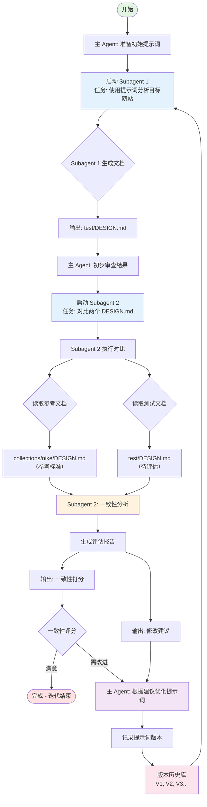

+++
date = '2026-04-15T20:17:10+08:00'
draft = false
title = '提示词优化迭代系统：多 Agent 协作的设计链路'
description = '基于闭环反馈的多 Agent 协作系统，通过迭代对比生成结果与参考标准，持续改进提示词质量。包含设计链路、可优化点、问题点与扩展方案。'
tags = ['ai', 'agent', 'prompt-engineering', 'iteration', 'system-design']
categories = ['ai-engineering']
+++

## 系统概述

这是一个基于多 Agent 协作的提示词自动优化系统，通过迭代对比生成结果与参考标准，持续改进提示词质量，直至达到预设的一致性阈值。

### 核心流程图



---

## 核心设计链路

### 第一阶段：初始化

**角色：** 主 Agent

**任务：**
1. 加载初始提示词模板
2. 配置目标网站 URL：`https://www.nike.com/`
3. 设置参考标准文档路径：`collections/nike/DESIGN.md`
4. 初始化版本历史库（空）
5. 设置一致性评分阈值（建议：85/100）

**输出：**
- 初始提示词 V0
- 迭代计数器 = 0

---

### 第二阶段：生成循环（迭代核心）

#### 步骤 2.1：启动生成 Subagent

**角色：** Subagent 1

**任务：**
1. 接收当前版本的提示词
2. 访问目标网站 `https://www.nike.com/`
3. 使用提示词分析网站内容
4. 生成品牌设计文档

**输出：** `test/DESIGN.md`

**关键技术点：**
- 网站内容抓取与解析
- 基于提示词的结构化生成
- Markdown 格式输出

---

#### 步骤 2.2：主 Agent 初步审查

**角色：** 主 Agent

**任务：**
1. 读取 `test/DESIGN.md`
2. 检查文档完整性（必需章节：品牌概述、设计规范、视觉元素等）
3. 快速格式验证
4. 记录迭代元数据（时间戳、提示词版本）

---

#### 步骤 2.3：启动对比 Subagent

**角色：** Subagent 2

**任务：**
1. 读取参考文档：`collections/nike/DESIGN.md`
2. 读取测试文档：`test/DESIGN.md`
3. 执行深度一致性分析

**分析维度：**

| 维度 | 权重 | 评估内容 |
|------|------|----------|
| 结构完整性 | 20% | 章节覆盖、层级结构 |
| 内容准确性 | 30% | 品牌信息、设计规范的准确性 |
| 细节丰富度 | 20% | 颜色、字体、间距等细节 |
| 格式规范性 | 15% | Markdown 语法、代码块格式 |
| 语言表达 | 15% | 专业术语使用、表述清晰度 |

**输出：**
- 一致性打分（0-100）
- 详细评估报告（逐维度打分）
- 具体修改建议列表

---

#### 步骤 2.4：迭代决策

**角色：** 主 Agent

**决策逻辑：**
```
if 一致性打分 >= 阈值:
    输出最优提示词
    生成最终报告
    终止迭代
else:
    进入优化阶段
    返回步骤 2.1
```

---

#### 步骤 2.5：优化提示词

**角色：** 主 Agent

**任务：**
1. 解析 Subagent 2 的修改建议
2. 识别低分维度对应的提示词问题
3. 生成优化策略
4. 更新提示词

**优化策略示例：**
- **结构完整性低分** → 补充"必须包含以下章节"指令
- **内容准确性低分** → 增加"请核对以下关键信息"指令
- **细节丰富度低分** → 添加"请详细描述每个设计元素"指令
- **格式规范性低分** → 强化 Markdown 格式要求
- **语言表达低分** → 提供专业术语示例

---

#### 步骤 2.6：版本管理

**角色：** 系统

**任务：**
1. 迭代计数器 += 1
2. 将优化后的提示词保存为 `V{计数器}`
3. 记录到版本历史库
4. 生成对比报告（V{n-1} vs V{n}）

**版本记录格式：**
```json
{
  "version": "V3",
  "timestamp": "2024-04-15T20:30:00Z",
  "prompt_content": "...",
  "test_score": 72,
  "changes": ["补充了颜色系统章节要求", "增加了间距规范说明"],
  "diff_from_previous": "..."
}
```

---

### 第三阶段：收敛输出

**当一致性评分达到阈值时：**

**输出内容：**
1. 最优提示词版本
2. 最终一致性打分报告
3. 完整迭代历史
4. 优化趋势图
5. 效果对比表格（V0 vs V最优）

---

## 可优化点

### 1. 评估维度权重动态调整

**当前问题：** 固定权重可能无法适配不同类型的网站和文档

**优化方案：**
- 根据参考文档的特征自动调整权重
- 例如：电商网站侧重"内容准确性"，设计网站侧重"细节丰富度"

### 2. 并行化多个测试网站

**当前问题：** 只在 Nike 网站上测试，泛化能力未知

**优化方案：**
- 同时在多个同类网站（Adidas、Puma、Under Armour）测试
- 使用平均分评估提示词的泛化性
- 只有多网站都达标才算收敛

### 3. 增量式生成

**当前问题：** 每次都是全量生成，浪费计算资源

**优化方案：**
- Subagent 2 识别低分章节
- 下一轮迭代只生成需要改进的章节
- 其他章节复用上一轮结果

### 4. 自动阈值调整

**当前问题：** 固定阈值可能导致过度优化或收敛困难

**优化方案：**
- 初始阈值设低（如 60 分）
- 每轮迭代根据改进幅度动态调整
- 连续 3 轮改进 < 2 分时自动降低阈值要求

### 5. 提示词模板库

**当前问题：** 每次从零开始优化，效率低

**优化方案：**
- 预置针对不同网站类型的提示词模板库
- 根据网站特征自动选择最接近的初始模板
- 减少迭代轮次

---

## 问题点

### 1. 幻觉风险

**问题描述：** Subagent 1 可能生成网站上不存在的信息

**解决方案：**
- 在提示词中强调"只生成网站明确展示的信息"
- 引入事实核查 Subagent
- 对生成的关键信息进行交叉验证

### 2. 迭代发散

**问题描述：** 可能出现提示词越来越复杂但效果反而下降

**解决方案：**
- 限制最大迭代次数（如 20 轮）
- 记录历史最优解，发现退化时回滚
- 引入提示词复杂度惩罚机制

### 3. 收敛过慢

**问题描述：** 某些情况下需要几十轮迭代才能收敛

**解决方案：**
- 引入早停机制（early stopping）
- 连续 5 轮无显著改进时终止
- 分析卡点并人工干预

### 4. 参考文档偏差

**问题描述：** `collections/nike/DESIGN.md` 本身可能存在主观性或错误

**解决方案：**
- 使用多个专家标注的参考文档
- 计算参考文档之间的共识
- 只对比高共识部分

### 5. 网站内容变化

**问题描述：** Nike 网站可能在迭代期间更新，导致对比失效

**解决方案：**
- 每轮迭代缓存网站快照
- 所有 Subagent 使用同一快照
- 或明确标注网站访问时间戳

---

## 补充扩展点

### 6. 负样本对比机制

**设计思路：**
除了与参考文档对比，还引入负样本测试：
- 故意使用"反例提示词"生成文档
- 评估系统应能识别出明显的错误
- 验证评估系统的鲁棒性

**实现方式：**
```python
# 在迭代过程中随机插入负样本测试
if iteration % 5 == 0:
    negative_prompt = "请生成一个完全错误的 Nike 设计文档"
    negative_result = generate(negative_prompt)
    negative_score = evaluate(negative_result)
    assert negative_score < 30, "评估系统无法识别负样本"
```

### 7. A/B 测试框架

**设计思路：**
对于每个优化点，同时尝试多个策略，选择效果最好的：

**示例：**
- 优化"细节丰富度"时，同时测试：
  - 策略 A："请详细描述每个设计元素"
  - 策略 B："补充每个元素的 RGB 值、使用场景和设计意图"
  - 策略 C：提供具体的颜色、字体示例模板
- 使用多 Agent 并行测试
- 选择得分最高的策略

### 8. 可解释性增强

**设计思路：**
为每次迭代增加"推理链路"记录，让优化过程更透明：

**记录内容：**
```markdown
## 迭代 V3 决策记录

### 问题诊断
- 当前得分：72/100
- 主要短板：细节丰富度（45%）、格式规范性（58%）

### 优化推理
1. 细节不足分析：
   - 颜色系统缺少 RGB 值
   - 字体规范缺少 line-height、letter-spacing
   - 间距单位混用（px、rem、em）

2. 格式问题分析：
   - 表格缺少对齐声明
   - 代码块语言标注不一致
   - 链接使用相对路径而非绝对路径

### 优化策略
- 在提示词中添加"颜色系统必须包含 RGB 值"的显式指令
- 增加格式规范示例代码块
- 要求统一使用 rem 单位

### 预期效果
- 细节丰富度提升至 65%
- 格式规范性提升至 80%
- 综合得分预期：78/100
```

---

## 实施建议

### 优先级排序
1. **P0（必须）：** 解决幻觉风险、迭代发散
2. **P1（重要）：** 评估维度动态调整、并行多网站测试
3. **P2（优化）：** 增量式生成、A/B 测试、可解释性增强

### 技术栈推荐
- **Agent 编排：** Claude Agent SDK 或自定义框架
- **网站抓取：** Playwright 或 Puppeteer（支持动态内容）
- **对比评估：** 结构化 diff + LLM 辅助
- **版本管理：** Git + 自定义元数据存储

---

## 成功指标

| 指标 | 目标值 |
|------|--------|
| 最终一致性评分 | ≥ 85 |
| 平均迭代轮次 | ≤ 10 |
| 单次迭代耗时 | ≤ 2 分钟 |
| 提示词长度增长率 | ≤ 50%（避免膨胀） |
| 泛化测试通过率 | ≥ 80%（在同类网站上） |

---

## 总结

这个提示词优化迭代系统通过多 Agent 协作形成了一个闭环反馈机制：

1. **闭环路径：** 版本库 → Subagent 1 → 生成文档 → Subagent 2 → 评估打分 → 优化提示词 → 版本库
2. **核心价值：** 将人工优化提示词的经验转化为可自动执行的迭代流程
3. **扩展潜力：** 可应用于各类需要高质量结构化输出的场景

关键在于设计好评估维度和优化策略，让每次迭代都有明确的改进方向。
